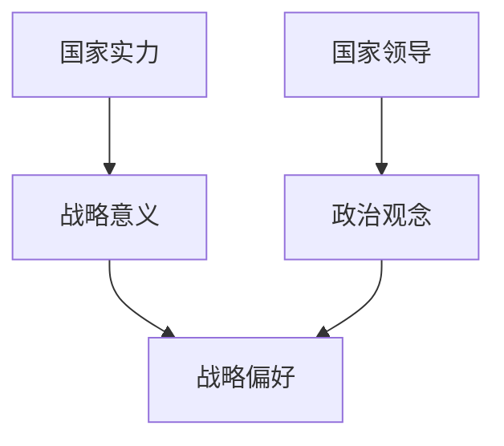
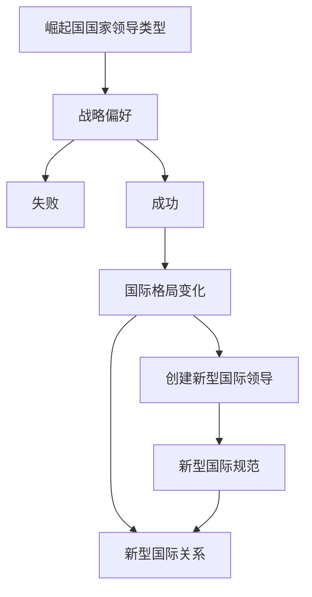
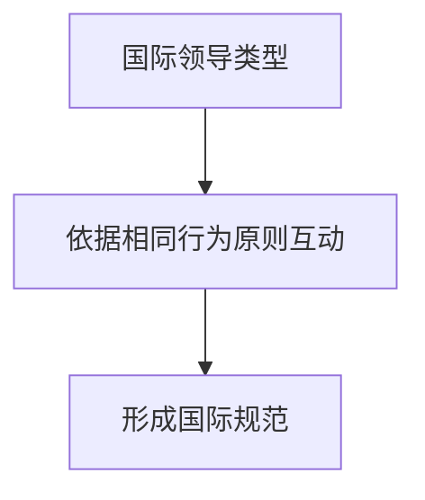
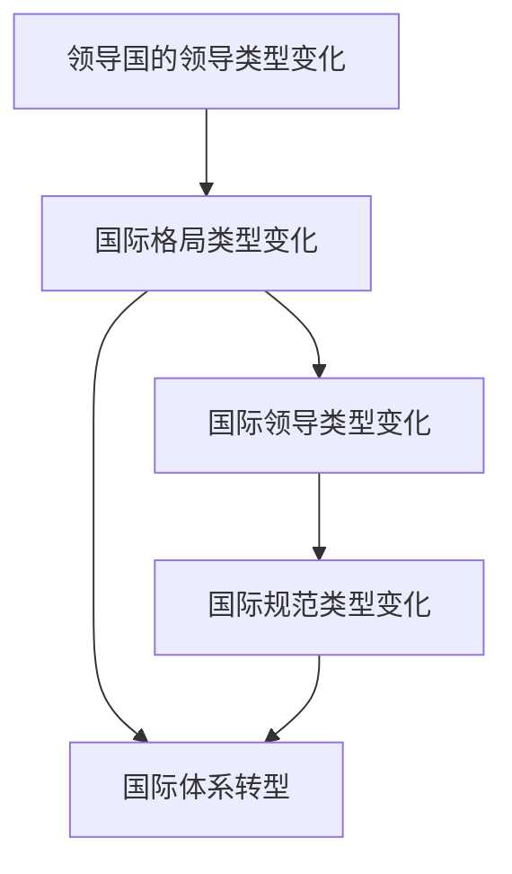

## 大国领导力
**作者**：阎学通 
**译者**：李佩芝

**理论**：政治决定论，道义现实主义

**论述目标**：解释中国的影响力为何日益扩大，为世界舞台上大国主导地位变化提供了一种具有挑战性的看法。

**主要观点**：
1. 国际权力的转移的原因是<u>崛起国具有比主导国更强的改革能力</u>。
2. 国内领导类型可以分为<u>无为型、守成型、进取型和争斗型</u>；国际领导类型可以分为<u>王道型、霸权型、昏庸型和强权型</u>。
3. <u> 国家领导力是决定一国外交政策、政治原则、意识形态等的关键因素</u>，因此同类型的政治领导对改革和对外战略取向的态度不同。
4. 当主导国和崛起国的领导类型不同的时候，这种差异对重塑国际格局、国际秩序、世界中心乃至整个国际体系都可能具有决定性作用。

**结论**：
* 未来十年中国崛起和美国相对衰落将会对国际政治和世界格局产生重大影响。
* 中美竞争不会导致冷战，但是<u>世界中心将会从欧洲转向东亚</u>。

---
[toc]


***
**全书结构**：
* **§1**：道义现实主义理论使用的主要概念及其定义。
* **§2**：政治领导（国内领导&国际领导）类型和战略偏好之间的联系。
* **§3**：基于现实主义理论的假定，从对外战略、国际格局、国际规范、世界秩序的变化以及这些变化对国际体系的影响引出4个推论。
* **§4**：论述国际格局变化和世界中心转移的问题。
* **§5**：描述国际领导类型与规范类型的关系。
* **§6**：探讨自由主义面临的挑战和新的主流价值观形成的可能性。
* **§7**：通过区分体系构成的要素变化与体系变化的不同，讨论国际体系的转型问题。
* **§8**：古代邦交史与现代国际关系来说明主导国领导变化与国际体系转变之间的关系。
***
### §1 道义、权力和权威

* 国际关系最重要的一个课题是**世界中心的转移**，在16世纪形成全球国家体系后，主导国先后更迭过5次，目前可能正在第6次的更迭中。
* 随着主导国家的变化，世界权力的重心有时候会从一个地区转移到另外一个地区，作者认为目前世界权力的重心正在由欧洲向东亚转移。
&nbsp;

**霸权的衰落：**
* Paul Kennedy在*The Rise and Fall of the Great Powers*中认为，霸权的衰落是<u>帝国的过度扩张引发的世界中心的转移</u>。帝国过度扩张的原因是政策制定者认定的全球义务远大于霸权的防御能力。
* Robert Gilpin在*War and Change in World Politics* 中认为，霸权的衰落的重要原因是经济上的严重不足，也就是维持国际现状以保持其主导国地位所需的经济成本远超过其财政实力。
* Richard Ned Lebow在*The Tragic Vision of Politics* 中认为，霸权的衰落原因在于其违背了当时公认的道义规范，破坏了其大国的地位、影响力以及霸权。

* 阎学通认为经典国际关系理论仅解释了霸权为何会衰落的原因，而忽视了后进国家为何会崛起的研究。阎学通认为<u>崛起国的领导力比主导国以及同时代其他国家的领导力更强且更高效的时候，这些国家的国际权力将会以崛起国胜过主导国的方式进行重构</u>。
&nbsp;

**道义在现实主义理论的作用**：
* 建构主义学派认为，道义是<u>影响政治实体制定规范的重要因素之一</u>，与制定者的身份和理论有所关联。故认为规范和利益是互相建构的、互为主体的。
* 自由主义学派认为，<u>道义的力量来源于自身，所以应当用道义论的方法解释学习对制定政策的影响与群体性认识的形成</u>。
* 英格兰学派分为社会连带主义和多元主义，两者均从规范角度研究道义，但对规范的功能看法不同。
  * 聚合主义认为，<u>规范是一种类型的自变量</u>；
  * 多元主义者认为，<u>规范是无政府主义的产物</u>。  
&nbsp;
* 现实主义者通常会被认为持有治国责任和道德原则无关的理论，但Morgenthau的古典现实主义著作中强调了道义和权力的关系，其也是非常关注正义问题的：
  * Morgenthau认为现实主义拒绝把某一国的道德法律当作普世的治理原则，并认为不能过高或过低地估计伦理对国际政治的影响，不能否认政治家和外交官的行为也受物质权力之外的因素驱动。
    * 因此，<u>摩根索反对将国家的道义和国际道义混为一谈</u>，反对根据一国特殊的道义价值观发动战争，不支持通过战争手段输出本国价值观，不支持美国以人权为理由发动战争。
    * 阎学通认为应当在普世层面而不是国家层面定义政治领导的道义。
  * Mearsheimer在*The False Promise of International Relations* 一文中提出，现实主义不是规范的理论，也没有给出道义判断的标准，目的是试图解释世界是如何运作的，因此不应该将道义纳入现实主义的理论模型中。
    * 阎学通反对Mearsheimer的观点，认为其忽略了Morgenthau话语的限定条件。Morgenthau认为根据特定时间和地点的具体情况来决定是否以道义原则来进行行动是可以避免危险的。阎学通认为Mearsheimer忽略了这个要点，并论证了道义行为对国家实力的影响。
    * Mearsheimer持进攻性现实主义观点，认为现实主义应当不扩展自身理论到不熟悉的领域中去。
  * 阎学通认为，根据现实主义国家共识（国家利益是客观的，是由国家的物质实力决定的），道义现实主义将强调战略偏好大过于强调理论偏好。
 &nbsp;
 
 **道义的层次和构成**：
  * **道义判断**：如果<u>国家的行为符合普适性的道义准则</u>，那么它就是道义的，反之就是不道义的。
    * 判断一国行为是否道义，应当由人民进行普世价值判断。倘若“是”回答多于“否”，则该行为是道义的，反之亦然。
    * 判断决策者行为是否道义，应确定用何种准则及逆行判断。这往往取决于行为者的身份，其分为<u>个人、政府和国际</u>三个层次。
  * **公共道义和个人道义的区别**：*（克林顿总统弹劾案）*
    * Niebuhr在*Moral Man and Immoral Society*中指出，个人道义行为和社会群体的道义行为是有区别的，<u>个人道义伴随着个体自我的升华进入群体后，在更高的层次重新表达这种利己主义</u>。
    * Max Weber提出了“责任伦理”观点，认为政府有义务阐明其行为可预见的结果。政府对它所代表的国家和它所治理的人民的责任是政府道义的核心。
    *（**例**：特朗普政府坚持无道义外交行为，创造了全球领导真空，进而让中国填补，破坏了美国和传统盟友的战略关系，使美国的竞争对手联合起来，推动主要大国在华盛顿抛售他们的股票）*
  * **普世道义**：人类所拥有的行为基础准则，实验心理学认为人类有5个伦理基础的倾向，分别为“关心/伤害”，“公平/欺骗”，“忠诚/背叛”，“权威/破坏”，“神圣/堕落”。全人类无论文化背景，总会崇尚前者，鄙夷后者。
    * 国际条约建立在这些道义基础上，如《日内瓦公约》（关心/伤害），NATO（忠诚/背叛），联合国（权威/破坏），《巴黎协定》（神圣/堕落）等。
    * 国家容易遵守一些基本的道义原则（与盟国保持关系，礼遇外国领导人，确保外交使节安全，偿还外债），但难以实现一些利他主义的行为（外援，人道主义救援等）。
    


####  权力，实力和权威
**权力与实力的区别**：

* “power"有多种含义，可以同时指社会影响力、物质实力和政治权威。
* Morgenthau用“power”和“elements of power"分别指代了“权力”和“实力”。
* Gilpin认识到了这一点，将其定义为“国家的实力”
* 从这以后，对于“power”的定义一直模糊不清。这成为了Morgenthau的理论缺陷之一，他无法区分其是一种国家利益还是国家利益的基础。
&nbsp;

**综合实力公式**：
```math
CC=(M+E+C)×P
```
**CC:** 综合实力   **M**：军事实力   **E**：经济实力   **C**：文化实力    **P**：政治实力  

* 除了政治实力是操作性实力外，其余均为资源性实力。
  * 政治实力具有扩大和缩小其他三个要素的作用，如果政治实力是0，那么其他任何要素将不会起作用。
  * 政治实力取决于国家领导的效率，国家领导效率取决于政治的改革方向和执行力度这两个主要因素。
  * Joseph Nye认为“软实力”（包含文化、政治价值和外交政策）与这其中的政治实力不同。一国的吸引力总是以该国领导人的行为i而不是以该国文化和政治价指的行为作为基础的。
  * 阎学通认为政治领导力而非政治价指才是软实力的核心要素。政治价指提供观念，但并不是最终决定领导的决策，所以美国的文化价值保持不变的情况下软实力在特朗普上台后大幅下降了。
  * Nye为了补充这一不足，创造了“巧实力”的概念，认为其是软实力和硬实力结合起来的技巧“。但这实际上就是其软实力三要素中的外交政策。
 
* 阎学通认为，意识里界定国际礼仪可以避免误判导致的灾难性政策的制定。可以以综合国力将世界各国分为4个等级：
  * **主导国**：利益为维持世界主导地位
  * **崛起国**：扩大国际权力
  * **地区/次地区大国**：维护主要地区的主导权，不获取世界霸权
  * **小国**：生存

* 9·11后美国将“绝对安全”作为国家利益目标，发动反恐战争。但根除恐怖主义远超美国实力，因为恐怖主义已成为普遍现象，看不到有效的解决方案。美国不仅没有实现目标，并且削弱了自己的国家实力。
* 中日2012年发生钓鱼岛争端，日本忽视了两者海军当时客观实力均等的现实，也忽视了中国对这些岛屿主权的维护决心，贸然实施国有化。中国采取强硬立场，宣布领海基线和防空识别区，引发持久对抗。
&nbsp;

**权威**：国际权威是由战略信誉决定的，通过道义行为获得。其重要因素是履行他国（尤其是盟国）的承诺，保护盟国、惩罚国际秩序破坏者被视为道义行为。
* 盟国愿意相信领导国的承诺，服从其领导；
* 领导国的敌人相信其维护国际秩序的决心时，不敢轻易挑战领导国。
&nbsp;

缺乏战略信誉的国家往往会遭遇外交失败。
* “俄罗斯间谍案”，18个国家驱逐俄罗斯外交官，根本原因在于俄罗斯没有战略信誉；
* 伊拉克战争，美国未经过联合国授权，使得其国际权威急剧下降。
* 2008年次贷危机曝光华尔街欺诈行为，使得标准普尔将美国的信用评级下调；
* “阿拉伯之春”的颜色革命浪潮中，奥巴马抛弃了美国盟友穆巴拉克；
* 特朗普采取美国优先战略，退出多个国际组织，奉行单边主义政策。

####  结论

* 古典现实主义理论家从未抛弃道义的概念，重视道义在国际关系理论中的作用。
* 道义可以分为个人、政府和国际三个层次。其中政府道义是一种公共道义而非个人道义；国际道义是一种普世道义而非民族道义。
* 实力为国家力量，权力为国家影响力。政治领导是操作性因素，君士、文化、经济是资源型因素。
* 权力的基础是暴力，权威的基础是他人的信任，两者都是领导力的根源，但后人让他人自愿接受领导，这是前者无法做到的。
***

### §2 领导与战略偏好
**讨论重点**：崛起国为何能超越主导国成为新的世界领导国。

  * 国际关系理论常常忽视可以作为自变量的政治领导类型，导致了现有国际政治理论无法解释为什么2017以来中国和美国的差距缩小得如此之快。

#### 领导的作用和类型
* 政治势力是综合实力的操作性变量，政治领导是政治实力的核心部分。
* 一国实力不变的情况下，该国的领导类型是有可能改变的，并且会随着领导类型的改变制定出不同的对外战略。
  * 习近平这一届中国政府改变了以往的对外战略，从韬光养晦变为奋发有为。
&nbsp;

**领导的作用**
* 决策是一种集体行动，而不是某个领导者的个人行为，所以政治领导是由决策的领导团队而不是最高领导人一个人完成的。
  * 最高领导人∈领导团队≠最高领导人，即便是独裁体制也是如此，最高领导人与其团通过政治选拔机制和活动自然地聚合在一起。
  * Hermann and Hagen认为，过度的集体凝聚力会形成“集体思维”，并且会导致权力大的决策者的政策偏好草率地成为决定。
  
**领导的类型**
* 国家领导的政治合法性是由法律、传统或者宗教决定的；国际领导则是由物质实力和其他国家的支持决定的（一带一路为倡议，而非战略）
* 据此，国家领导可以分为4种类型：无为型、守成型、进取型和争斗型。

|**对国际地位的态度**|**负责**|**不负责**
| --- | --- | --- |
|**维持现状** |守成|无为
|**改变现状** |进取|争斗

1. **无为型领导——道家**：采取无为而治哲学的国家领导。这类领导认为，保持现有国际地位的最佳策略是无为而治，避免国内出现争论，通过外交妥协迁就国内的反对派。
2. **守成型领导——经济决定论**：主张维持现有国际地位，维护往届政府所取得的成就，视经济为一国综合实力的基础，认为扩大经济收益是维持本国已有地位的最佳战略。这是最常见的领导人。
3. **进取型领导——政治决定论**：通过事宜的改革提高国际地位的领导，这类领导信奉政治决定论，认为政治人才是决定性因素，将国家的兴衰归因于国家的领导能力而非其他因素。这种领导人在任何国家的历史上都不多见，代表人物：李世民、习近平、etc.
4. **争斗型领导——社会达尔文主义**：具有以军事手段提高国际地位的国家领导，信奉社会达尔文主义，相信包括军事侵略在内的暴力效率。代表人物：嬴政、成吉思汗、努尔哈赤、希特勒、特朗普。
&nbsp;

#### 崛起国的领导和战略偏好
**无为型领导——回避冲突**：无为型领导倾向于回避崛起困境，崛起困境为崛起国实力和影响力的迅速增长导致其面临日益增长的国际战略压力或者他国的负面反应。例如：无为型领导会倾向于维持台湾现状以避免和美国发生战争的危险。其战略有两个明显优势，（1）对治国能力要求不高，（2）这种策略的效果较为明显。
**守成型领导——运用经济影响**：信奉经济决定论，倾向于用经济或者贸易的影响他国的外交战略，故采取扩大与冲突国的经济关系来缓解国际压力。以经促政战略在某种意义上是正学的，但也会往往局限于经济领域，无法产生宏观建构。
**进取型领导——扩大国际支持**：为扩大本国的国际权力，进取型领导云姨承担战争风险和保护盟国的代价来维持同盟，这样做会加剧守成国家和崛起国家的结构矛盾，前者会试图遏制后者，也会在周边国家获取必要的政治和军事支持来对抗主导国的压制。
**争斗型领导——军事扩张**：多进行机会主义扩张，军事攻击中小国家，包括主导国的盟友。这种战略有发生大规模战争的危险，且失败率很高，故争斗型领导经常缺乏恐惧战争的常人心理。
&nbsp;

#### 领导类型的变化
常见的领导类型转变机制有两种：<u>政权更迭</u>和<u>自我转型</u>。
**政权更迭**：一个国家最高领导人的变更，常伴随着新领导机构的建立。例：1949年中华人民共和国取代中华民国，美国总统从民主党人转变为共和党人。
**领导自我转型**：在国家最高领导人不更迭的情况下发生的领导类型转变，在执政后期因为各种原因，领导人的意识会发生改变，所以领导类型也会发生改变。例：以色列前总理拉宾从反穆斯林主义者到签订《奥斯陆协议》，尼克松从反共产主义者到与中国建交，普京从进取型领导转变为争斗型领导。
&nbsp;
阎学通认为，影响崛起国和主导国战略竞争结果的主要因素是它们在赢得国际支持方面的领导力的差别，赢得较多国际支持的一方是竞争的赢家。

#### 战略信誉和国际领导

* 国际领导分为**王道型、霸权型、昏庸型和强权型**四种类型，这四种类型的国际领导在国际体系中运用其领导权的时候有着不同的偏好。
* 与国家领导不同的是，国际领导不以政治权利为基础，战略信誉使得行为体具有合法性，从而使得其能够吸引到国际追随者。
* 国际领导的权威是以良好的战略信誉而不是以国家实力为基础的，故领导国要保持良好的战略信誉才能享有崇高的国际权威。
  * 冷战结束后，克林顿政府通过和更多国家结盟提高了美国的战略信誉。
  * 中国在冷战后不愿意为邻国提供安全保障，即便是成为世界第二大经济体后，盟友政策也从未在中国政治界得到具体的实施。
&nbsp;

|**行为准则**|**守信誉**|**不守信誉**
| --- | --- | --- |
|**标准一致** |王道型|强权型
|**双重标准** |霸权型|昏庸型

**王道型领导**：
* 王道型领导是守信誉并政策标准一致的国际领导。
* 王道型领导的外交政策和国际规范相符合并具有战略信誉，领导国如果实行道义原则，就会被视为王道型领导。
* 王道型领导以三种方式维护良好的战略信誉和国际秩序。
  * 按照国际规范办事，以身作则地为其他国家树立良好榜样；
  * 奖励遵守规范的国家，推行有益的国际规范；
  * 惩治违反国际规范的国家以维护国际规范。
* 例：罗斯福政府。

**霸权型领导**：
* 霸权型领导是守信誉但采取双重标准的国际领导。
* 双重标准体现在：对盟友信守承诺，提供援助，因此值得信任；对竞争对手冷酷无情，因此其竞争对手会认为其没有遵守国际规范。
* 霸权型领导模式巩固了同盟关系，但是对整个国际体系起着破坏的作用。
* 例：冷战后期美苏政府。

**昏庸型领导**：
* 昏庸型领导既不守信誉又采取双重标准，这样的领导是不负责任的，这种类型的领导是不负责任的，其外交政策原则是随波逐流地附和其他大国。这是一种欺软怕硬的领导，因此在战略上毫不可信。
* 昏庸型领导不承担维护国际规范的责任，其行为常常是自相矛盾的和混乱的。
* 由于昏庸型领导的政策不一致，朝令夕改，所以在盟国中没有信誉。这种领导的不可靠性使其所在国际体系的其他成员倾向于靠自身军事力量维持生存。
* 因此，使用军事手段解决国际冲突成为常见的现象。
* 由于昏庸型领导主导的国际体系没有秩序，所以这种类型的领导是注定要被摧毁的
* 例：特朗普政府。

**强权型领导**：
* 不守信誉但行为标准一致的是强权型国际领导。
* 强权型领导按照强权政治的原则制定对外政策，因此盟友和敌人都不信任它。
* 当领导国的领导地位建立在其他国家的恐惧之上时，这种领导国就属于强权型领导。
* 当强权型国家成为主导国时，它率先破坏国际道义规则，这不可避免地会引起其他国家的效仿。于是，道义规范消亡而非扩展，这种由强权国主导的国际社会经常处于战争状态。
* 强权领导的不道义行为强化无序体系的丛林法则，同时破坏其他国家实践的道义原则。
* 二战期间由希特勒领导的德国纳粹政府和日本军国主义政府被人们普遍视为典型的强权型领导。
&nbsp;
* 虽然国家领导和国际领导各有4个类型，但它们之间并无一一对应的关系，因为这两种领导的性质是不同的。
* 国家领导只为自己的国家承担责任，因此只关心自己的国家利益。国际领导既对本国也对国际体系的秩序负责。
* 由于这一根本性差异，在国内和国际两个层面，领导国可能分别有不同的战略偏好。
* 有一种误解，以为能够增强本国综合实力的国家领导必然是好的国际领导。从理论上来说，无为型领导和争斗型领导不如守成型领导和进取型领导那么重视战略信誉，但这并不能确保后两者就是王道型领导。
&nbsp;

#### 王道原则

* 在4种国际领导中，王道型领导和霸权型领导有能力维持相对稳定的国际秩序，而昏庸型领导和强权型领导则不能。
* 王道型领导和霸权型领导在提供国际领导的方法上有很大区别。
&nbsp;

**霸与王的区别**：
* 王道原则的主张者倾向于使用胡萝卜，而霸权原则的主张者提倡使用大棒；
* 中国主张霸权原则的人用“雄才大略”取代“霸权”，而美国主张霸权原则的人用“仁慈的霸权”来区分美国的霸权与以往历史上的霸权；
* 王道原则还要求统治者的内部治理与其外交行为是一致的，即“<u>内圣外王</u>”（国内治理遵循圣人的原则，而对外交往遵循王道原则）
* 内圣外王要求内政和外交政策都以人为本，增强王道型领导影响的重要前提是领导国在国内和国外奉行一致的价值观；
  * 自由主义在冷战后成为当代主流价值观，这与美国政府实行的国内政策密切相关；
  * 这个论点并不否认欧洲政府起了重要的影响作用，而是强调领导国的国内政策在维护自由主义的主导地位中具有关键作用；
  * 2017年美国政府开始在国内倡导反建制主义，自由主义在全球的影响力就迅速下降，这一事实可进一步支持上述论点。
* 尽管中国将在未来10年中成为最强大的崛起国，但在可预见的未来，中国不太可能奉行王道原则；
  * “千禧一代”与其父辈的政治观念不同，这源于他们的现代教育背景和国际经验；
  * 在基础教育阶段，他们既接受了中国传统文化教育，也学习了现代科学知识；
  * 因此，这代人中产生的领导人，可以很容易地理解采取王道原则能让领导国有更多机会保持长期主导地位的逻辑。

####  结论

* 从类型上来说，国家领导和国际领导属于不同的范畴。国家领导可分为4种：无为型、守成型、进取型和争斗型。国际领导也可分为4种：王道型、霸权型、昏庸型和强权型。
* 由于无为型、守成型、进取型、争斗型的领导分别信奉道家学说、经济决定论、政治决定论和社会达尔文主义，所以他们的战略偏好也相应地有所不同。在应对崛起困境的问题上，崛起国的4种领导很可能分别选择回避冲突、运用经济影响、扩大国际支持和军事扩张的战略。
* 4种国际领导通常采用不同的外交战略来维持国际秩序：王道型领导依据国际道义规范制定政策，霸权型领导实行双重标准原则，昏庸型领导采取不负责任的行为，强权型领导依据强权政治原则行事。
* 4种国家领导的类型和4种国际领导的类型并非一一对应。能够增强领导国实力的国家领导并不一定是会提供王道的国际领导，也不一定能建立稳定的国际秩序。同理，削弱本国国际地位的政府也不必然是强权型的国际领导。
* 在全球化时代，王道原则具有成为国际领导行为准则的优势。王道原则可以将某些自由主义价值观纳入其核心价值观，从而使王道型领导成为对联合国大多数成员国有利的领导，这与传统的霸权和美国的仁慈霸权不同。王道领导采取的道义原则可增强其追随者对王道领导的信心。然而，要使王道原则成为为人所普遍接受的规范，领导国的国内意识形态与它在国际上提倡的政治价值观必须是一致的。
***
### §3 关于国际变化的推论
**讨论重点**：阐述一个关于国际格局、国际规范、国际秩序和国际体系变化的新理论，具体讨论<u>政治领导、国际格局、外交战略、国际规范、国际秩序和国际体系</u>等变量之间的关系。

#### 国家领导与权力格局的变化
* 主导国几乎在所有可见的领域包括政治体系、意识形态、技术、教育、经济和军事领域都比正在崛起的国家更为先进，但崛起国戏剧性地缩小与主导国之间的实力差距；
* 权力从主导国向崛起国转移的原因在于崛起国领导力的提高和主导国领导力的下降；
* 同类型的国家领导导致大国实力的不平衡增长，持续几十年就会导致整个国际格局发生变化。

**阎学通推论1**：国家领导力的提高和下降导致国家间相对实力的变化，最终导致整个国际格局的变化。
* 国家领导决定国家实力的增长或下降。
   * 国家综合实力的公式中侧重人类有意识的行为，即政治领导，其对增强、维持或削弱国家实力起着至关重要的作用；
   * 由于国家领导是资源要素转化为国家实力的基础，各国的国家领导效率不同，可从两个方面导致国家实力不平衡增长:
     * 不同的国家领导效率导致资源性要素以不同的速率增加;
     * 不同的国家领导效率使相同规模的资源性要素起到不同的实力作用.
   * **例：** 1991年苏联的解体和2017年美国的迅速衰退都支持了国家领导比综合实力的资源性要素更重要的观点。
   
**阎学通推论2**：主导国和崛起国的领导不一样决定了国际格局的变化。
* 国际格局是指由大国的相对实力及相互战略关系决定的权力结构。在国际关系理论研究中，三种典型的国际格局分别为单极格局、两极格局和多极格局。
* 在现实世界中，许多格局都是这三种典型格局中任意两种的混合体。
* 由于国际格局是由大国的实力结构和它们的战略关系构成的，因此国际格局的变化不仅取决于大国实力的兴衰，而且受它们同盟数量变化的影响。
   * **例：**：冷战后国际格局从两极格局向单极格局转变就是由两个因素引起的：一是俄罗斯与美国的实力差距扩大（国家实力的变化）；二是华沙条约组织（以下简称华约）瓦解，俄罗斯失去了盟友（同盟数量减少）。
   
#### 国家实力与国际地位
* 根据实力大小可以将国家划分为如下4个等级：主导国、崛起国、地区大国和小国。
  * 主导国和崛起国实力的增强或减弱对一个独立的国际体系的国际格局变化是有影响的，而地区大国和小国的实力变化则没有那样的作用。

* **主导国**：在独立的国际体系中具有支配性影响力的国家，而这个国际体系不一定是全球性的。全球国际体系是在1500年左右形成的。在这之前的古代曾有过几个独立的国际体系。
* **崛起国**：这些国家综合实力的增长能达到缩小与主导国之间实力差距的程度，使它们能够夺走主导国的部分权力。19世纪70年代的美国是个崛起国，20世纪50年代的苏联和80年代的日本都是崛起国。2008年金融危机爆发后，中国成为典型的崛起国。
* **地区大国**：这些国家在地区或次地区事务中占有主导地位，虽然它们在一个独立的国际体系的某一局部地区没有竞争者，但在整个国际系统层面仍受主导国的影响。现在，俄罗斯、日本、德国、法国、英国、巴西和澳大利亚属于地区大国，印度、南非、沙特阿拉伯和印度尼西亚属于次地区大国。
* **小国**：实力太弱以至在地区或次地区体系中都发挥不了任何领导作用的国家。

* 基于上述对国家实力级别的定义，主导国和崛起国在一个独立的国际体系中争取一个对自己最有利的格局，地区大国密切关注其所在地区的权力格局变化，小国则无意重塑任何层面的国际格局。

#### 国家实力、领导和战略偏好

* 阎学通既强调政治领导在决策中的重要性，也强调国家实力的重要性。战略包括目标和实现目标的方法。
* 国家实力决定国家的客观利益，即国家的战略目标，而国家领导决定实现国家利益的方法。
* 故此，外交战略是由这两个变量共同决定的。
  * 一方面，国际体系的无政府性要求各国决策者根据各国实力审慎地界定本国的战略利益；
  * 另一方面，它为政策制定者提供了创造独特战略以实现国家利益的空间。


**阎学通推论3**：在无政府状态的国际体系中，所有国家维护自身战略利益的原则都是自保，但采取的外交策略是不同的.

* 现实主义认为，由于在无政府的国际体系中缺少能合法垄断军事力量的组织，所以国家的生存只能靠自己而无法靠他国。
* 事实上，国家追求和保护安全利益靠自身实力，其中包括制定合理外交战略的能力。
* “自保”原则反映了国际体系的无政府本质，根据这一原则：
  * 在同一国际体系中，不同的国家领导会采取不同的战略；
  * 不同的国际领导会带来不同的国际秩序。

* **不同类型的国家领导采取不同的战略来实现战略利益。**
  * 国家实力是界定国家战略利益的基础，也限制了战略选择。
  * 因为获取不同的利益需要不同的实力，所以，与大国相比，较小的国家通常将其战略利益定得较低。
  * 故此，它们采取的安全战略也不同于大国。
* eg. 美国不仅要保护本国安全，而且要保护其盟友的安全；日本不仅不需要保护他国的安全，而且将维护自身安全的部分责任委托给了美国；梵蒂冈则将自身安全全部委托给意大利来保护。
* 在无政府体系中，较小国家将保护本国安全的责任委托给较强大国家或同盟是个普遍现象，因为它们的军事力量不足以确保它们的生存。
* 除了国家实力不同，国家领导类型不同也是各国采取不同战略的原因。
* 实力相同的国家采取不同的安全战略。
&nbsp;
* **不同类型的国际领导倡导不同的国际秩序。**
* 阎学通认为大国获得或保持其主导地位的战略不止一种，正如生态系统中的主导物种可凭多种多样的策略获得数量优势。
* 在人类历史上，强国普遍采用进攻性战略，但这并非唯一可行的战略。在任何时代，主导国所面临的国际体系、国际规范和军事技术都不同于上个时代。主导国采用新发明的战略会比模仿已有的战略更有效地扩大其权力。

#### 国际领导与规范的改变
* 国际关系的现实主义者认为人性是自私的，因此由人控制的国家也必然是由自身利益驱动的。

**阎学通推论4**：追求自身利益是国家行为的首要动机，也是制定国际规范背后的压力。

* **追求自身利益是国家行为的首要动机，但同时受到社会规范的影响。**
* 决策者的社会观念可能会从两方面影响决策。一是观念影响决策者的国家利益排序，即在具体情况下，哪些国家利益应给予优先考虑。二是观念影响着决策者实现国家利益的战略偏好。
* 决策者的社会观念确实影响他们把哪个利益置于首位，以及何种战略最能实现利益。
* **国家对自身利益的追求同样是建立新国际规范的动力。**
* 根据古典现实主义假定，追求自身利益也是领导国建立新国际规范的动力。
* 军事力量和国际规范是两个需结合使用的维护持久国际秩序的基本手段，单独使用两者中的任何一个都不足以实现这个目标。
  * 主导国的首要利益是维持现行国际秩序，因为这种秩序是主导国按照有利于自身战略利益的原则建立起来的。为了尽可能长久地维持这种秩序，主导国需要设立一套国际规范让其他国家来遵守。这些规范稳定了国际秩序，从而降低了维护秩序的成本。
  * 虽然国际规范也约束主导国的行为，但主导国从它所建立的国际秩序中得到的收益远大于其他国家，因为这些规范给它提供的战略优势远大于不利之处。
* 改革现行国际规范的另一个重要力量是崛起国，因为现行国际规范一般是有利于主导国的。
* 当崛起国大幅缩小与主导国之间的实力差距时，它将寻求朝着有利于自身的方向改革现行国际规范。

#### 国际秩序变化与国际体系转型
**阎学通推论5**：权力的零和性导致崛起国与主导国之间的结构性矛盾，并影响现行国际秩序。

* **崛起国与主导国之间的结构性矛盾是不可避免的，因为两者都追求体系内的主导地位。**
  * 领导权主要是根据大国实力结构分配的。因此，崛起国试图得到更大的权力，而主导国即使相对实力已下降，仍拒绝与崛起国分享其权力。所以，结构性矛盾的本质是维护和改变现有国际权力分配结构的斗争。
  * 对崛起国而言，结构性矛盾还表现为崛起困境，即外部压力随着其影响力的扩展而增大。
  * 同样地，崛起国的迅速增长将对其他国家（主要是主导国）产生强烈冲击，其不可避免的结果是这些国家不是拼命抵制就是全面对抗。
* **权力再分配的分歧导致国际秩序不稳定。**
  * 国际秩序是指国际体系中的行为体以非暴力手段按国际规范解决冲突的状态。这意味着只要没有国家诉诸武力解决矛盾，国际秩序就能维持下去。
  * 通过暴力行为恢复秩序同样属于混乱状态。在无政府的国际体系中没有军事垄断，因此任何对现状不满的国家都可能以武力实现其所诉求的利益。
  * 由于人天生渴求权力，无论是主导国还是崛起国，都不满足于国际体系中现行的权力分配。
  * 虽然主导国比其他国家拥有更大的权力，但它仍追求更大权力。
&nbsp;
* Hedley Bull把国际体系定义为“当两个或两个以上的国家之间有足够的接触，并对彼此的决定产生足够的影响，使它们各自的行为成为整体的一部分——至少在某种程度上是这样，国家构成的体系（或国际体系）便形成了”。
* Bull把国际秩序定义为“维持国家社会或国际社会的基本目标或首要目标的活动模式”
* 根据自由贸易和公平贸易的原则，国际社会可以建立两套不同的国际贸易规范。国际贸易秩序的规范性质是由国家在贸易中遵循哪种规范决定的。
* 尽管二者共享同一个构成要素，但是国际秩序和国际体系各自都还有两个互不相同的构成要素，这一点经常被国际关系学者忽视。国际体系的构成要素还有行为体和国际格局，国际秩序的构成要素还有主流价值观和机构安排。



####  结论
道义现实主义得出4个推论：
1. 国家领导力的提高或下降导致国家间相对实力的变化，最终导致整个国际格局的变化；
2. 在无政府状态的国际体系中，所有国家维护自身战略利益的原则都是自保，但采取的外交策略是不同的；
3. 追求自身利益是国家行为的首要动机，也是制定国际规范背后的动力；
4. 权力的零和性导致崛起国与主导国之间的结构性矛盾，并影响现行国际秩序。
* 这些推论并不是相互排斥的，而可能是部分重叠的。

***
### §4 权力再分配与世界中心
**讨论重点**：即推动目前中美两极化的关键因素、引发全球冷战所需的条件，以及新的世界地缘政治中心形成的条件。

* 当前的两极化伴随着世界地缘政治中心的转移。虽然两者都源于权力再分配，但发生的条件并不一样。
* 对当前两极化的分析认为，国家领导力的提高或下降导致国家间相对实力的变化，最终导致整个国际格局的变化；对冷战发生条件的分析认为，在无政府状态的国际体系中，所有国家维护自身战略利益的原则都是自保，但采取的外交策略是不同的。

#### 领导与两极化
* 当今世界的两极化并不意味着中国已经获得了与美国同等的权力，而是意味着中国的国际地位正在向超级大国接近，在即将到来的两极格局中成为一极。
* 尽管中国目前的权力尚未与美国并驾齐驱，但目前国家权力分布状态是，中国比其他大国的权力已经大很多。
* 在一些欧洲人看来，“如今两大领导国（美国和中国）与排名第三的国家之间的权力差距，与1950年两个超级大国和其他大国的差距相似”。

* 中美综合实力差距缩小得有多快不仅取决于中国的实力增长速度，而且取决于美国的实力增长速度。如果美国的实力增长速度和中国的一样，那么它们的实力差距将会扩大而不会缩小，因为美国综合实力的基数大于中国。
* 如果这样，两极化就会停止，美国将重获巩固其单极领导所需的实力。然而，如果中国能保持比美国增长快的趋势，那么两极化就会持续下去。
* 从2014年起，中国与美国的GDP差距几乎停止缩小，2015年起开始拉大。

#### 美国是否会衰落？
学术界对美国是否已经相对衰落持两种对立的看法。

* 一方认为美国是不可能衰落的，即使在相对意义上，美国也不可能衰落。
  * 第一个依据是历史经验。在20世纪60年代末，有人认为苏联会崛起并超过美国；在20世纪80年代和90年代初，一些人认为日本会崛起并使美国黯然失色。然而，历史证明这两个有关美国衰落的预言都错了。这意味着中国崛起并超越美国的预测将会重复相同的结果，也会被历史证明是错的。
  * 第二个依据是作为一个民主国家，美国比中国具有更强的自我修复能力。美国总统选举制度使美国能够比中国更及时地调整其政策，这将会防止中国赶上和超过美国。
  * 第三个依据是美国主导的单极世界具有持久性的理论论据。努诺·蒙特里奥说：“单极格局原则上是持久的，在我们如今的核世界里更是如此，大国战争的预期代价高得可怕。
* 另一方则认为，美国正处于相对衰落的状态，并将在越来越多的领域失去世界第一的地位。
  * 这一派的论点通常基于经济数据，比如美国无法偿还其国际债务，而中国已经成为美国最大的债权国。截至2012年年底，美国当年产生的财富不足以偿还其年终的债务，美国当年的GDP为15万亿美元，年终的债务为16.2万亿美元，比GDP高出1.2万亿美元。
  * 特朗普上任后，越来越多的知识分子把美国日益恶化的财政赤字归咎于他的税收政策。爱德华·麦卡弗里说：“特朗普的计划将使债务和赤字大幅增加。”那些认为美国正在相对衰落的人甚至认为中国会利用其债权地位来遏制美国的增长。

* 阎学通认为，虽然美国的确相对衰落了，但不能从金融角度解释美国衰落的原因。表面上看，美国的相对衰落源于政府的债务政策，但其根本原因是美国缺乏在国内实施政治改革的政治领导，这才是美国无法避免中国缩小与其实力差距的关键。

* 导致国家领导类型发生变化的因素很多，其中落后的国际地位具有特殊作用。落后的国际地位常常激励一国领导实行改革；反之，对本国的国际地位越满意，一国领导的改革决心就越弱。
* 美国面临的问题是相对衰落，而非绝对衰落。也就是说，美国的绝对实力比大多数大国增长得快，仅比中国增长得慢。相对衰落的性质使美国政府可通过自己的历史进行纵向比较，或与中国之外的大国进行横向比较，轻易地证明美国的进步。
* 当美国的综合实力比中国强得多的时候，任何美国领导都很难像中国领导那样热衷于改革。由于改革会损害利益集团的切身利益，因此中美两国的改革都面临着阻力。利益集团会充分利用它们的法律权利和社会资源，拼命捍卫它们的特殊利益。

#### 世界中心的构成条件

* 目前的两极化使地缘政治进一步成为一个全球性的问题。然而，关于地缘政治中心究竟会向哪里转移，各种看法大不相同。
  * 一位阿根廷学者认为世界中心正在从西方向东方转移，并且从北方向南方转移；
  *  一些中国学者则认为，全球经济中心正朝着亚洲移动。
  * 2010年，时任中国外交部部长杨洁篪在回答墨西哥记者关于这一问题的提问时说：“目前国际上确实有这样一种观点，认为世界的权力重心正在从西方向东方转移。我并不认同这一观点。”

##### 世界地缘政治中心的界定标准
* 英国地缘政治战略家哈尔福德·约翰·麦金德认为：**“谁统治了东欧谁就能主导心脏地带，谁统治了心脏地带谁就能主导世界岛，谁统治了世界岛谁就能控制世界。”** 虽然他的论点在国际关系学者中很受欢迎，但许多历史事件并不支持他的观点。
  * 纳粹德国在二战期间统治了东欧，但德国战败了并被分为民主德国和联邦德国两个国家。
  * 苏联在冷战期间控制着东欧，但它并没有因此强大到足以统治整个世界，而是后来解体为15个国家。
  * 欧盟吸收了东欧国家，但这并没使欧盟更强大，反而削弱了欧盟成员国之间的一体化。
* 世界中心不是由自然地理位置决定的，而是由位于中心地区的国家的实力决定的。具体而言，一个地区成为世界地缘政治中心有两个必要条件。
  * 第一，它**必须是世界上最具影响力国家的所在地**。也就是说，这个地区有一个或多个国家，其物质实力水平（特别是军事实力和政治实力水平）是第二等级国家所达不到的。
  * 第二，**世界地缘政治中心应该是大国激烈争夺的地区**。历史表明，领导国之间的战略竞争体现于两个方面：一方面是极力控制它们自身所在的地缘政治中心区，另一方面是权力竞争从地缘政治中心向边缘地区扩散。当领导国所在地区没有权力竞争时，该地区成不了世界地缘政治中心。
&nbsp;
* 冷战期间，美苏是世界上最强大的国家，也是全球体系中的主要战略敌手。作为两极之一的苏联的所在地，欧洲是这两个超级大国战略竞争最激烈的焦点地区。故此，欧洲才能在冷战期间保持其国际政治中心的地位。
* 美国在冷战的两极格局和冷战后的单极格局中都是全球最强大的竞争者，但欧洲在这两个时期被视为世界地缘政治中心。
* 美国的地理位置是不变的，它既是一个太平洋国家，也是一个大西洋国家。二战结束以来，美国一直是世界上最强大的国家，而且今后10年它仍可能是最强的超级大国。**由于美国将继续是超级大国，其地理位置又不变化，因此美国难以成为目前世界地缘政治中心转移的因素。**
* 虽然2008年金融危机后欧洲国家和美国都经历了实力的相对下降，但它们各自对地缘政治中心转移的影响是不同的。今后10年内，美国的相对衰落不会改变其世界超级大国的地位，作为一个全球竞争者，美国无疑仍将是东亚地区的主要战略玩家。然而，欧洲国家的相对衰落已将其全球影响力降至不及一些东亚国家的水平。
* 此外，欧洲可能失去世界地缘政治中心地位还有另一个因素，也许是最重要的因素，那就是**没有任何欧洲国家（包括德国和俄罗斯）有足够强的实力成为世界级的竞争者**，任何欧洲国家都没有成为超级大国的潜力。与此同时，中国作为东亚新的超级大国正在崛起，并日益成为全球性的战略竞争者。总而言之，驱动当前地缘政治中心转移的原因是欧洲大国和中国的实力地位换位。
* 中国作为一个正在崛起的超级大国，其实力迅速增长，使国际格局从一极向两极转变，这不仅导致权力再分配，而且推动了世界地缘政治中心从欧洲向东亚的转移。
* 中国的崛起将使东亚出现一个新的具有全球影响力的超级大国，并使东亚地区具有比欧洲更强的经济实力和军事实力。与此同时，中美两国在未来10年都将拉大与其他大国的实力差距，如日本、德国、俄罗斯、英国、法国和印度等。这种两极化不可避免地引起了中美在东亚的激烈竞争。
####  结论
* 中美两极化是中美两国综合实力差距缩小的结果，但其根本原因是中美两国的领导效率差别。
* 克林顿政府之后，美国经历了三任领导，但没有一任像同期中国政府那样进行有效的政治改革。低效的领导使美国基本上无法阻止中美之间实力差距的缩小。
* 随着争斗型领导在多数大国盛行，两极化可能会在未来10年内加速进程。
* 领导国的权力再分配促成了国际格局的转型，但不一定会导致世界地缘政治中心的转移。世界地缘政治中心的形成有两个必要条件。
  * 第一，该地区至少有一个具有领导地位的战略竞争者。
  * 第二，该地区必须是至关重要的，以至掌有这一地区的主导权是获得世界领导权的先决条件。
  * 第二个条件推动了相互竞争的领导国争夺那个地区的控制权。如今，中国崛起和美国相对衰落所引起的权力再分配正在改变冷战后的格局，即从单极格局走向两极格局。

***
### §5 领导与国际规范
**讨论重点**：在国际体系中国际规范是如何伴随领导国的外交行为而变化。对这一观点所做的分析是建立在追求自身利益是国家行为的首要动机，也是制定国际规范背后的压力这一结论之上的。也就是说，主导国建立或维护有利于其主导地位的国际秩序的意愿是其改变国际规范的动力。由于不同类型的国际领导具有不同的战略偏好，因此不同类型主导国与其他国家的互动有可能促进国际合作，也有可能加剧国际冲突。

#### 有关领导与规范变化的早期研究

* 20世纪60年代，行为主义学者从政治领袖的个人特点、教育背景、宗教信仰、政治经验和专业知识的角度研究对外决策。他们有关领导者类型的一些结论有助于讨论这个问题。例如，理查德·斯奈德和他的同事将领导者分为两类：一类是目的驱动型，另一类是原因驱动型。
* 对于这两种类型的领导者，詹姆斯·多尔蒂和罗伯特·法尔茨格拉夫认为，前者有意识地创建或改革规范，后者则无意识地创建或改革规范。
* 研究国际规范的理论家普遍赞同玛莎·芬尼莫尔和凯瑟琳·辛金克的观点，即领导国的变化是国际规范性质变化的先决条件。他们认为新国际规范的形成通常要经历三个阶段：
  * 一是领导国提倡新的规范；
  * 二是大多数国家遵循这种规范；
  * 三是这种规范被内化或社会化为指导国际行为的普世原则。这种方法一方面说人们的观念变化改变了国际规范，另一方面又说国际规范建构了人们的国家利益观念。
* 领导国提倡的新规范，有时能成功成为国际规范，有时则不能。根据这种现象，约翰·伊肯伯里和查尔斯·库普钱研究了领导国成功建立新国际规范的过程和条件。他们发现主导国通过三个机制将新的国际规范社会化为其他国家的行为原则，这三个机制是**规范劝说、外部诱导和内部改造**。
  * 第一个问题是规范劝说和外部诱导有相互重叠之处。规范劝说包括告知较弱国家依据某种行为原则采取行动的潜在好处以及不这样做的坏处。这种劝说与外部诱导有相似性。
  * 第二个问题是外部诱导经常被纳入内部改造的努力之中，以改变弱国的国家领导。
  * 第三个问题是内部改造混淆了社会化的过程和结果。
* 尽管外部诱导和内部改造能使他国领导接受主导国提倡的规范并将其体现于政策之中，但这并不意味着这种规范在那个国家已经社会化了。不管政策制定者是被说服的、被强迫的还是被改造的，他们对新规范的接受都仅能表明社会化进程的开始，而不是已经社会化的结果。
#### 领导类型与规范类型
##### 国际规范的分类
* 四种领导类型分别拥有不同的行为，这四种类型是王道型、霸权型、昏庸型和强权型。
* 既然国际领导的类型是指领导国决策的指导原则，那么就可以根据领导国的外交政策判断其国际领导的类型，就如同一个人是否随地吐痰可反映其对公共卫生的态度。
* **国际规范**： 在独立的国际体系中为大多数国家所接受的关于权利和义务的行为原则。这一定义包含暴力行为和非暴力行为的规范。
  * 这一定义同时还强调，主导国的外交政策原则在被大多数国际成员国接受之后才能被视为国际规范，因为只有这样，这些规范才是通行的，才足以影响大多数国家的行为。
* 国际社会具有自然和社会两个属性，这意味着国际规范与这两个属性都有关系。这一现实要求我们根据基本的对外行为来区分国际规范的类型，这些对外行为要么源于国际社会的自然属性，要么源于其社会属性。
* 借用荀子对大国对外行为原则的分类，可以将其修改为4种国际规范：**强权政治规范、恃强凌弱规范、双重标准规范和道义规范。**这4种规范分别来自4种不同类型的领导：**强权型、昏庸型、霸权型和王道型。**

|**体系属性**|**行为一致**|**行为不一致**
| --- | --- | --- |
|**社会** |道义规范|双重标准规范
|**自然** |强权政治规范|恃强凌弱规范

* **强权政治规范**是指通过强制手段（主要是军事力量）获得国家利益的原则。16—19世纪欧洲国家对殖民地的争夺体现的就是这种原则，它们的所作所为依据的是当时的征服权和占领权的原则。
  * 强权政治规范是建立在人的天性基础之上的，在没有更为进步的社会规范约束的情况下，强权政治规范就成为普遍的国家行为原则。
* **恃强凌弱规范**经常源于昏庸型领导的行为。昏庸型领导也是由天性驱使的，但没有政治原则，他遵循恃强凌弱的原则，即霸凌弱者但惧怕强者。在拥有比其对手更强的物质实力时，这类领导国经常欺负其他国家，不在乎自身在国际体系中的战略信誉。然而，面对强硬的国家，无论是大国还是小国，昏庸型国家都会因怯懦而避免与它们发生冲突。
* **道义规范**是指国家所遵循的在某个具体历史时期以合法手段获取利益的原则。当大多数成员国为了和平解决争端而接受这些原则时，这些原则便成了规范。当道义规范被削弱时，强权政治原则会自动恢复为支配国家行为的规范。与强权型领导和昏庸型领导不同，王道型领导国遵循道义原则，基于国际社会的社会属性，这些道义原则被公认为进步的礼仪。
* 在国际关系史上，**双重标准规范**比其他三种规范更常见。由于国际社会既有自然属性又有社会属性，强权原则和道义原则常常同时影响国家的行为。在多数情况下，霸权国对付敌国时运用强权政治原则，而对友好国或盟国则实行道义原则。既然这种做法在国际体系中非常普遍，那么我们就将这种情况定义为双重标准。

##### 建立国际规范的机制
领导国的行为决定了它们的领导类型，同时它们的行为会促使其他国家效仿它们所采取的行为原则。当大多数国家采用这种原则时，这种原则就会社会化为国际规范。

*在分析国际领导类型与国际规范的关系时，我们将前者视为自变量，后者视为因变量。国际领导类型变化后，通过领导国与其他国家的互动，国际规范发生变化。也就是说，领导国与其他国家之间的互动是干预变量，是中介，领导类型是通过这一中介改变国际规范的。干预变量可以起常规互动的作用，这会加强现有的国际规范，但也能起非常规互动的作用，那就会导致新规范的出现。*

* 符合现行规范的行为属于**常规互动**，而违反现行规范的行为属于**非常规互动**。
* 常规互动能<u>加强</u>现行国际规范，非常规互动则能<u>改变</u>现行国际规范。国际规范类型的改变是通过国家间的非常规互动实现的。
* **文特：** 国际规范内化有三个路径：强制、奖励及合法性。内化是指有意识的行为变成下意识行为的过程。因此，为了获得奖赏或避免惩罚而遵守规范的行为是有意识的行为，不是下意识的行为。所以，强制和奖励都不是内化的结果，其所体现的是内化过程中的奖惩机制。相比之下，基于合法性的行为才是下意识的行为，体现的是内化的结果，而非内化的机制。
* **阎学通：** 用三个机制取代文特的三个路径，并认为所有类型的领导国都是通过这三个机制改变国际规范的。这三个机制是：**榜样-效仿机制**，领导国为其他国家树立榜样供其效仿；**支持-强化机制**，领导国奖励那些采取同类行为原则的国家；**惩罚-维护机制**，领导国惩罚那些违反这些原则的国家。当大多数国家将其行为原则转变为与领导国的行为原则一样时，这种行为原则就演变为国际规范了。

#### 国际规范的类型转变
##### 由国际领导塑造的规范类型

* 当国际领导是**强权型**时，其行为往往会削弱道义规范，促使其他国家遵循强权政治的原则。
  * 强权型领导国经常支持或鼓励其盟国对敌国采取争斗的立场，这客观上强化了它们对强权政治原则的信仰。
  * 在自身利益的驱动下，当强权政策有可能带来更大的利益时，强权型领导甚至可能以强权行为应对其他国家的道义行为。
  * 这样的行为给坚持道义原则的国家带来严重伤害，从而在客观上弱化其他国家对道义规范的信仰，促使它们增强采取强权原则的倾向。
* **昏庸型**国际领导的恃强凌弱行为导致阴谋和欺骗成为规范的行为。
  * 昏庸型国家是不负责任的国际领导，恃强凌弱的原则使其对外政策行为前后不一。
  * 这与霸权型国家的双重标准原则不同。霸权型国家重视盟国对自己的战略信任，昏庸型国家则很少顾及与盟国的战略关系。
  * 昏庸型国际领导不讲战略信誉，而其他国家的实力比它弱，战略利益比它少，于是其他国家就更不会严格履行承诺。
  * 在战略信誉无法维持的环境里，战略阴谋和欺骗就会成为流行的国际规范。
*  如果国际领导是王道型的，它的行为将符合道义原则，有助于以道义规范取代强权政治规范。
  *  **王道型国家**的基础是拥有比其他国家更强大的物质实力并实行道义外交政策。要建立或维持道义规范，领导国需要有能力奖励遵守道义原则的国家，惩罚违反道义原则的国家。
  *  故此，奉行道义原则的领导国需要以合法的武力方式建立和维护道义规范。
*  **霸权型国际领导**实行双重标准原则，其他国家也照例以道义原则对待盟国，以强权政治原则对付敌国。
  *  虽然霸权型国际领导的道义行为有助于推进与盟国互动的道义原则，但也促使双重标准原则成为国际规范。
  *  所以，霸权型国际领导为了保持霸权，就得采取道义政策在盟国间建立起战略信誉。
  *  为了巩固和扩大同盟，霸权国需要遵循道义原则为其盟国提供安全保护。霸权型国际领导增强道义规范的机制与王道型国际领导的机制一样，即胡萝卜加大棒。
  *  以强权政治原则为指导的霸权行为，则会促使其敌国以同样的方式做出反应，从而使强权政治原则成为霸权国与敌国之间的规范。（苏联解体后俄罗斯试图加入西方阵营）
  *  权型国际领导所遵循的双重标准原则是由其与盟国和敌国的关系决定的，因此与规范变化的方向没有冲突。通过榜样-效仿、支持-强化、惩罚-维持三个机制，其双重标准行为促使其他国家在决策中也采取双重标准原则，对盟国实行道义原则，对敌国实行强权政治原则。
  * 西方国家容忍以色列拥有核武器，但不能容忍伊朗的核项目。双重标准行为是与国际体系的自然属性和社会属性相一致的普遍现象。

##### 国际规范的演变方向
国际规范类型的变化是单向的还是双向的，这是个关于国际规范演变方向的理论问题。文特把国际规范分为三种类型：**霍布斯文化型规范、洛克文化型规范和康德文化型规范**。

* 霍布斯文化型规范指的是**敌人之间的对抗规范**；
* 洛克文化型规范指的是**竞争对手之间的竞争规范**；
* 康德文化型规范指的是**朋友之间的合作规范**。
&nbsp;
* 文特认为国际规范是单向演变的，他说：“在本章结论里，我会讨论随着时间推移产生进步的问题，我认为，虽然不能保证国际时代会朝着康德文化型规范前进，但至少它不太可能倒退。
&nbsp;

* 国际规范的变化可分为**程度变化和类型变化**两种。当国际领导的类型没有变化时，国际规范往往需要很长时间的程度变化才能出现类型变化。这就是为什么一种规范的类型可以保持主导地位长达百年甚至更长时间。
* 当崛起国取代前主导国的领导权时，国际规范是有可能发生类型变化的，因为新的领导国可能提供一种不同于之前的国际领导。多数国际领导的转换的确不会改变领导类型，那是因为崛起国和前主导国多是同类型的国家。
* 一种类型的国际领导持续的时间越长，它所提倡的国际规范就越能得到社会化和内化。一种类型的国际领导长期持续意味着领导国可依据某一类型的行为原则与其他国家长期持续互动。这些互动使那种类型的原则在国际上得以社会化，在许多国家内部得以内化。

####  结论

* 国际领导的4种类型分别是**王道型、霸权型、昏庸型和强权型**，它们相应创建的国际规范是**道义规范、双重标准规范、恃强凌弱规范和强权政治规范**。
* **一种新型国际规范的形成，往往是新领导国与其他国家互动使之内化和社会化的共同结果。**
* 非常规互动是指新国际领导与其他国家依据不同于现行规范的行为原则进行互动，这种互动促进新型国际规范的形成。
* 常规互动会巩固现行规范，而不会引起国际规范的类型改变。
* 非常规互动并不一定是战争，国际领导权的和平转移有可能伴随着国际规范类型的和平改变。
* 战争通常能比领导权和平转移更迅速地改变国际规范的类型。
* 无论权力转移是战争方式还是和平方式，崛起国与前主导国之间的领导类型差别是导致国际规范类型变化的原因。
&nbsp;

* 形成新型国际规范的机制有三个：**榜样-效仿机制、支持-强化机制和惩罚-维持机制**。
* 在这三个机制中，榜样-效仿机制在新国际规范的形成中起着最根本的作用，因为任何主导国都无法建立起它自己不予以实践的国际规范。
* <u>支持-强化机制和惩罚-维持机制是通过诱导或强制的方法使其他国家按照主导国所倡导的规范行事</u>，这两个机制在新规范的社会化和内化方面发挥的作用小于榜样-效仿机制。
* 另外，榜样-效仿机制还能促使其他国家自愿遵循主导国采取的行为原则。要使新的行为原则社会化，即成为国际社会大多数成员国普遍接受的行为规范，前提是将其内化。因此，对主导国建立新的国际规范来说，以身作则是比其他两个机制更为有效的方法。

* 不同类型国家间的国际领导类型转变不如相同类型国家间的权力转移那么频繁，而且转变的方向是朝着更好的领导还是更差的领导也是不确定的。
* 因此，**国际规范演变方向是非线性的**，国际规范类型的每次转变取决于崛起国与前主导国类型是否相同。
* 以往的历史表明国际领导类型和国际规范类型的变化是随机的。
* 虽然以美国自由主义价值观为指导的现行国际规范已经维持了20多年，但它面临着将来被或进步或倒退的新型国际规范取代的可能性。
* **无论自由主义规范在可见的未来是否会改变，任何类型的国际规范都不可能永远不变**，这一点是确定的，而规范演变的方向是不确定的。

***
### §6 国际主流价值观

* 当崛起国所提倡的价值观不同于前主导国的价值观时，价值观冲突就成为崛起国和主导国两国战略竞争的一部分。
* 本书的推论4是，**权力的零和性导致崛起国与主导国之间的结构性矛盾，并影响现行国际秩序**。
* **讨论重点**：本章集中于当前自由主义价值观面临的挑战、即将到来的争夺地区主导地位的意识形态竞争，以及王道价值观现代化的可能性。

#### 有关领导与规范变化的早期研究

* **没有任何一种现代意识形态能保持其国际主流地位超过30年。**
  * 不断有新的现代意识形态获得这种主导地位，如20世纪初的民族主义、20世纪30年代的法西斯主义、20世纪50年代的共产主义、20世纪60年代的民族主义和20世纪90年代的自由主义。
  * 所有这些现代意识形态对现代国际体系影响的主导地位都没有儒家思想主导华夏体系的时间长。

##### 有关领导与规范变化的早期研究
* 由于对自由主义原则既定目标的理解不同，自由主义者提倡的观点是多种多样的。因此，在世界不同的地方，“自由主义”的含义各有不同。
  * 在美国，自由主义曾是与罗斯福总统倡导的新政中的福利国家政策相关联的，而在当代美国的保守主义中也有自由放任经济学的思想。
  * 在欧洲，自由主义通常与政府责任和承诺的社会福利有关，而在拉丁美洲国家和许多曾经被共产主义统治过的国家，自由主义通常与社会主义有关，因此一般称为社会自由主义。
  * 在中国，自由主义在政治上指的是西方民主，在经济上指的是市场经济。
 * 尽管存在上述差异，但任何国家的自由主义一般都肯定平等、自由、民主、民权、世俗政府、国际合作，以及支持这些理念的相关方案。
 * 自由主义首次成为显赫的政治运动是在启蒙运动时期，先是在西方哲学家和经济学家中流行起来。
 * 20世纪上半叶，西方自由主义从欧洲民主国家向世界其他地区扩散，主要因为民主国家在两次世界大战中都取得了胜利，它们拥有主导地位。
 * 二战后，美国成为事实上的自由主义的最主要倡导者，其霸权实力使美国自由主义平等和自由的价值观能影响国际规范变化。

* 冷战期间，由于自由主义被看作直接反对共产主义东方压迫的西方意识形态，所以自由民主政府使整个西欧取得了巨大的社会进步，这使自由主义价值观在几乎所有领域都得到加强。
* 随着美国主导的西方阵营在与苏联主导的东方阵营的战略竞争中取得胜利，自由主义成了冷战后的国际主导意识形态。西方世界的胜利使许多人相信自由主义价值观是卓越的。
* 弗朗西斯·福山甚至说：“我们现在看到的可能不仅仅是冷战的结束，或者战后某一特定历史阶段的结束，而是这样一种历史的终结：人类意识形态的进化到达了终点，西方自由民主制度的普世化使之成为人类政府的最终形式。”（福山日常hhh）
&nbsp;

* 自由主义在西方国家衰落的根源与其在非西方国家衰落的根源不同。
  * 在西方国家，导致这种衰落趋势的主要原因是，2008年金融危机后民主政府未能有效地恢复国内经济，致使民众不满。
  * 同时，西方国家的经济增长速度比崛起国慢，再加上前者的外交政策是双重标准，这导致非西方国家中支持自由主义的观点失去影响力。
  * 此外，人们对西方国家采取双重标准外交政策的印象，使自由主义变得更难流行。
  * 在中国，自由主义正在失去其全球主流价值观的地位，这给其他意识形态创造了竞争影响力的机会。因此，许多国家的民众担心当前的自由主义秩序被按中国价值观建立的新秩序取代。
&nbsp;

* 中国的意识形态情况是复杂的。首先，中国政府所倡导的官方意识形态与普通民众的世俗价值观不一致；其次，即使是马克思主义这个被说成是指导国内政治生活的官方意识形态，也不同于适用于外交政策的独特的中国传统文化。总之，在中国外交政策制定中有如下4种意识形态竞争其影响。
  1. 马克思主义是中国共产党的官方意识形态，但它对实际外交政策的影响很小。中国政府表示，要以马克思主义指导一切工作，如“发展中国特色社会主义文化，就是以马克思主义为指导，坚守中华文化立场……必须推进马克思主义中国化时代化大众化，建设具有强大凝聚力和引领力的社会主义意识形态”。然而，中国政府在解释其外交政策时，似乎并不能说马克思主义。事实上，自1978年改革开放以来，由于马克思主义的核心思想是阶级斗争，与在改革开放原则下强调国际合作形成矛盾，因此中国政府从未说过以马克思主义作为外交政策的指导思想。后来，和平发展成了指导外交政策的基本原则，这种外交政策无法用马克思主义指导。2004年时任中共中央总书记胡锦涛制定了和平发展的原则，从此这一原则成为指导中国外交政策的正统原则。既然阶级斗争是马克思主义的核心，它就不可能与和平发展相协调。反之，如果用阶级斗争思想指导外交政策的制定，将给中国造成好斗的国际形象。
  2. 经济实用主义是邓小平在1978年推行政治改革后中国政府和大众最广泛接受的意识形态。随着爆发世界大战的可能性大大降低，在中国经济繁荣成为人们判断意识形态合理性的标准。中国在过去40年取得的经济成就为经济实用主义奠定了坚实的社会基础。虽然中国政府自2013年以来不再把经济增长视为第一优先，但是绝大多数中国人仍然认为经济是综合实力的基础，因此拥护把经济利益作为主要政策目标的思想。在中国，经济实用主义的合法地位是以马克思主义的观点为基础的，即经济是政治上层建筑的基础。经济实用主义与史蒂夫·班农所代表的美国经济民族主义有某些相似之处，即在外交政策制定上，二者都是从经济角度界定战略利益，并强调对外贸易的重要性。
  3. 自由主义在20世纪80年代胡耀邦任党总书记时期是中国最流行的意识形态。那时，自由主义指导着各领域的改革，主要是模仿美国的模式。如今，自由主义只流行于知识分子之中。1989年天安门事件后，自由主义对中国政治改革的影响虽然停顿了，但其对经济和外交政策的制定仍然具有相当大的影响。自由主义在冷战后仍有影响力，当时中国外交政策的指导原则是韬光养晦，这一原则反映的主要是自由主义的价值观。2008年全球金融危机爆发后，自由主义对中国经济改革的影响力下降；2012年党的十八大之后，自由主义对外交决策就没什么影响了。2013年，“奋发有为”取代“韬光养晦”成为中国外交政策原则，这标志着自由主义对中国外交政策影响的终止。如今，中国已成为世界上最大的贸易国，中国支持自由贸易原则出于实用的原因，而不是因为自由主义对其政策有任何影响。只要中国继续缩小与美国之间的实力差距，自由主义在中国的影响力就不会恢复到20世纪80年代的水平。
  4. 传统文化派虽然不是官方意识形态，但其影响力在中国普通民众、知识分子和政治家中都显现上升趋势。传统文化派并不只是指儒学，而是指中国古代各种思想流派的集合。虽然中国古代思想流派之间存在分歧，但每个学派都强调政治领导与战略信誉在巩固和维持领导地位中的重要性。在这方面，所有流派都认为霸主的对外政策应该优先考虑其战略声誉。故此，古代“王道”思想促进了决策中的仁义价值观。传统文化派提倡以身作则的策略，因为领导具有示范效果，所以传统文化强调领导的重要性。这种意识形态鼓励中国承担更多的国际安全责任，特别是承担为邻国提供安全保护的责任，以提高其国际战略声誉。
#### 战略信誉的贬值

* 当前，自由主义在全球范围内呈衰落之势，中国国内的多种意识形态处于竞争状态，在两者的共同作用下，有可能出现一个没有主流价值观的世界。
* 只要特朗普政府继续削弱美国的国际信誉和领导力，同时无法使美国的实力增长快于中国，那么自由主义就不可能战胜非自由主义意识形态的挑战，恢复其在全球的主导地位。除非中国采取王道原则，否则中国也不太可能提供一个为全世界所接受的非自由主义意识形态。
* 目前，最大的可能性是，**没有全球性的主导意识形态，自由主义和其他的主要意识形态争夺在某一地区或某类国家中的主导地位**。这种国家的分类是多样的，有些是按地理位置划分的，有些是按政治制度或文化相似性划分的，有些则是按经济规模划分的。

##### 没有主导意识形态的时代

* 尽管特朗普政府推行反建制主义，但反建制主义几乎不可能在西方成为主导的意识形态，因此成为全球性的意识形态就更不可能了。
* 反建制主义的兴起大大削弱了自由主义在美国的主导地位，但它还没有盛行到足以压倒自由主义的程度。
* 虽然多数美国人还是以民主党人或共和党人来区分他们的政治身份，但是美国人现在也越来越倾向于以自由派或非自由派来区分。
* 这种现象意味着自由主义仍然是反建制主义最强有力的竞争对手，由于两者中的任何一种都不能在美国取得绝对优势，所以在国际上就更不可能了。
* 反建制主义不仅在美国内部分裂了美国人，而且破坏了西方的政治团结。在西方国家，自由主义者将国际条约和协定视为和平与安全的必需品。
* 冷战结束后，美国以多边的自由主义机制为基础，建立了其世界领导地位，而多边自由主义机制主要依赖西方国家的支持。然而，在反建制主义思想的指导下，特朗普政府一个又一个地退出此类机制。
* 中国内部的意识形态竞争和美国内部的意识形态竞争具有类似的作用。即使中国成为世界上最大的经济体，国内的意识形态竞争也会使中国在未来10年里无法为世界提供一种全球性的主导意识形态。
* 大国建立影响全球的意识形态有两个必要条件。
  * 第一个必要条件是这种意识形态在国内是政府和人民都信仰的。中国目前有4种相互竞争的意识形态，但任何一种都无法获得主导性的影响力，这也是党的十九大倡导“培育和践行社会主义核心价值观”的原因。
  * 第二个必要条件是一些国家的政治文化能使其愿意接受大国提出的意识形态。由于中国在经济上取得了成就，一些国家很可能会仿效中国的经济政策，但是不太可能仿效中国的官方意识形态。
* **中美两国不但缺乏建立全球性意识形态的能力，而且两国政府对进行意识形态竞争犹豫不决。中美两国都知道意识形态对抗是冷战的核心原因，因此迄今为止双方都有意限制竞争蔓延到意识形态领域，这种做法与美苏在冷战期间的做法完全相反。**

由于美国和中国都无力在未来10年中提供一个全球性的主导意识形态，未来的两极世界将可能与冷战时期不同。这个两极世界将不是两种具有全球影响力的意识形态之间的竞争，而可能是万花筒式的多种不同意识形态之间的竞争，竞争的是地区主导地位或对某类国家的影响力。

#### 超越自由主义

* 任何类型的国际领导都不可能是永久性的，这就使进步的国际领导有机会在未来出现。
* 当前的中美两极化意味着两件事，即中国将进一步缩小与美国之间的实力差距，以及将两国政治思想的优良传统相结合可建立起一种比自由主义更为先进的意识形态。
* 由于美国的自由主义仍然具有全球性影响，而中国正式宣称要用中国优秀的传统价值观来指导其外交政策，所以“千禧一代”的中美两国领导人都有可能学习对方的价值观建立一种更先进的意识形态。
##### 仁与平等的融合
* 自由主义的个人主义价值观往往导致人类之间的冲突而非合作。即使将平等定义为竞争机会的平等，当暴力手段是赢得竞争的最佳选择时，绝对平等还是会导致你死我活的争夺。
* 儒家“仁”的核心思想用于管理不对等的人际关系，如强者对弱者的关系、富人对穷人的关系、上级对下级的关系，从而减少由强势群体与弱势群体之间差异引起的社会冲突。
* 通过将平等与仁融合在一起，我们可以使公平成为一个普遍的全球性的价值观。
##### 义与民主的融合
* 民主是自由主义对人类政治生活的一项重要贡献，其核心是以大众的广泛支持使政府的行为合法化。
* 在现代公民社会中，从法律上来说，每一个公民平等地享有国家的主权和权力。
* 然而，众多的人口使决策面临着组织工作的困难，不可能让所有公民都直接参与国家事务的决策。于是，代议制成为明显可行的选择，即通过民主程序行使国家权力。
* 事实上，即使一国的行为具有国际合法性也不能确保其就自然是正义的。国际社会是一个无政府体系，因此国际机构成员国之间的权力主要是依据各自的实力大小进行分配的。因此，仅依靠国际机构的程序获得正义结果是罕见的。
####  结论

* 国际主流价值观对建立国际规范具有指导作用。依据这一准则，**自由主义衰落不可避免地会使自由主义的国际秩序受到挑战，同时使在美国指导下建立的当前的国际规范受到挑战**。
* 拥有30年的主导地位之后，自由主义的价值观受到了与其竞争的意识形态的挑战，如美国的反建制主义、欧洲的民粹主义、中国的传统价值观、中东的伊斯兰激进主义以及在发达国家和发展中国家都流行的经济民族主义。
* **在当前国际格局两极化中，无论是美国还是中国，都无力以一种新的价值观取代自由主义成为全球性的主导意识形态**。
* 未来10年可能会出现一个众多不同意识形态竞争的两极世界，这些意识形态将竞争地区的主导地位或竞争对某一类国家的影响力。
* 目前，个人决策机制在大国中流行，这导致了历史倒退趋势的出现。许多国家的决策者将更偏好秘密外交而非公开外交，更偏好搞阴谋而非对话，更偏好进行制裁而非谈判，更偏好贸易保护主义而非自由贸易原则，更偏好政治欺骗而非关注战略信誉，更倾向于军事霸凌而非战略威慑，更偏好双边主义而非多边主义。
* 各国将比以前更重视主权和特权，而不那么欢迎全球治理和区域化。
* 虽然未来10年可能是一个规范秩序倒退的两极世界，但在中美两国的“千禧一代”掌握国家权力后，他们有可能为世界提供一种先进的领导。
  * 目前，美式自由主义的影响力仍然大于其他意识形态，中国的崛起将增强中国传统价值观的国际影响。
  * 这两个因素为将中国传统的仁、义、礼的价值观与自由主义的平等、民主、自由的价值观相结合提供了机会，从而使它们成为现代化的公平、正义、文明。
  * 最终，将这些价值观融合起来，是有可能使之成为不同国家人民都接受的普适价值观的。

***
### §7 国际体系转型
**讨论重点**：历史表明，崛起国的成功往往带来国际秩序、国际格局或国际规范的变化，但大国成功崛起只是偶尔带来国际体系的变化，带来国际行为体类型变化的现象则更为少见。本章将先区分体系变化和体系构成要素变化，再分析国际领导对国际体系转型的影响。

#### 构成要素变化与体系转型

* 由于没有公认的体系转型的判断标准，国际关系学者对冷战后的国际变化有着相互对立的见解。一些学者把这种变化称为“国际体系转型”，另一些学者则称之为“国际格局变化”。
* 际体系在冷战期间和冷战后的唯一区别只是格局不同。国际格局从两极变为了一极，但国际行为体和国际规范仍然与冷战时期相同。
* 2008年全球金融危机爆发后，中美实力差距明显缩小，国际格局出现了两极化趋势。有些人把这一格局变化视为国际体系转型，甚至把它称为“500年来的第三次大转型”。然而，这样就无法对当前的变化是国际体系整体发生了变化还是国际体系的一个构成要素发生了变化做出合理判断。
&nbsp;
* 阎学通认为：**构成要素变化不等于体系转型。**
  * 一些连续的国际体系，其构成要素的类型都是相同的，如反法兰西联盟体系和维也纳体系。
  * 然而，另一些连续的国际体系，其构成要素的类型却有一个或两个不同，如凡尔赛—华盛顿体系和雅尔塔体系。
  * 这就产生了一个问题，即这些学术上所称的国际体系是否都有独立性，因为有些很可能是上一个国际体系的延续。
  * 行为体类型的改变并不必然带来体系转型。1648年签订的《威斯特伐利亚和约》可以看作民族国家的起点，但这种行为体变化在长达一个世纪的时间里只局限于欧洲。和约签订后，欧洲的国际行为体经历了从城邦、王国、君主国、帝国向民族国家发展的进程。
  * 格局转型并不必然标志着体系也转型。国际格局有三种基本类型：单极、两极和多极。
  * 国际规范的类型变化也不必然标志着体系就转型了。规范变化与体系转型之间的关系是一个需要进一步研究的课题。


#### 体系转型的条件

* 国际体系中的单独一个构成要素转变与国际体系转型之间没有严格的对应关系。
* 故此，按照逻辑我们需要弄清两个构成要素同时转变能否引起体系转型。
* 结果表明，以国际体系中任意两个构成要素同时转变为标准来界定国际体系转型，就能比较一致地解释上表中各类国际体系的转型了。
* 于是，我们可以认为，国际体系的转型与**至少两个构成要素同时转变相关**。

##### 国际体系转型与国际规范和国际行为体同时转变具有相关性

1. 从春秋到战国的体系转型中，主要行为体从天子授权的诸侯国变为独立的君主国。
2. 与此同时，国际规范也从禁止兼并变为认可兼并。在欧洲，从罗马帝国到中世纪的国际体系转型，经历了国际行为体从帝国到王国的变化，同时国际规范发生了从兼并到教权或分封的变化。
3. 三十年战争（1618—1648年）所引发的国际体系变化，见证了国际行为体从王国到民族国家、国际规范从教权到主权的变化。

##### 国际体系转型与国际格局和国际规范的同时变化具有相关性

1. 从西周到春秋的国际体系转型，经历了国际格局由一极向多极的变化，国际规范由分封向争霸的变化，但当时霸权争夺还是禁止兼并的。
2. 现代的典型案例是二战后国际体系从凡尔赛-华盛顿体系向雅尔塔体系的转型。在这个转型中，权力再分配使国际格局从多极转变为两极，国际规范从先占和兼并的原则转变为不干涉和不兼并的原则。

* 这两个案例表明，在国际行为体不变的情况下，国际体系是有可能发生转型的。在第一个案例中，主要国际行为体未变，仍是天子国和诸侯国；在第二个案例中，民族国家仍为主要国际行为体。

#### 政治领导与体系转型

* **历史表明，国际格局转型快于国际规范转型，而国际规范转型快于国际行为体转型。**
  * 在20世纪，国际格局经历了从多极到两极再到单极的变化，而国际规范只经历了一次转型——从强权政治变为双重标准，但在同一时期国际行为体保持未变，仍是民族国家。
* 国际行为体、国际规范和国际格局转型频率的差异，解释了为什么国际体系转型经常伴随着国际格局和国际规范的转型，而不是国际行为体和其他两个构成要素之一的同时转型。
&nbsp;
* 尽管我们还不清楚政治领导是否对国际行为体的类型变化有直接影响，但我们仍然可以认为**政治领导在国际体系转型中起着关键作用**，原因有两点。
1. 体系转型需要至少三个构成要素中的两个发生转变，且这二者之一不是国际格局就是国际规范。
2. 历史表明，国际体系转型比国际行为体转型频繁得多。这意味着国际规范和国际格局的转变比国际行为体转型更多地带来国际体系转型。与此同时，国际格局和国际规范的转型又都是由领导国的政治领导变化引起的。
&nbsp;
* 在国家层面，崛起国和主导国的国家领导类型在改变国际格局中共同发挥着作用。
* **崛起国领导通过持续的改革能够比主导国更快地提高其国家实力，当主导国的领导未能阻止任何崛起国缩小它们之间的实力差距时，国际格局就会发生变化**。
* 在国际层面，国际格局的变化使崛起国成为新的主导国，这一新主导国可能为世界提供与之前主导国完全不同的新型国际领导。国际领导类型的变化形成了新型领导，这就很可能建立起与以往类型不同的国际规范。
* 当国际格局和国际规范都发生转型时，原有的国际体系将转变为新型国际体系。


1. **领导国的领导类型变化**，无论是崛起国还是主导国的领导类型变化，都可能带来国际格局的变化。在现实中，这两种领导变更同时出现是非常偶然的，概率甚至小于理论上的1/9。这就是为什么崛起国中只有很少数能成功取代主导国的地位，以至崛起国取代主导国的现象要半个世纪或更长时间才会发生一次。
2. **由国际格局变化产生的新国际领导可能与之前的类型不同**。国际领导转型少于国家领导转型，这就解释了为什么国际规范转型不如国际格局转型那么频繁。虽然国际格局转型不必然与国际领导类型变化同时发生，但在某些情况下同时发生的情况也是有的。
3. 新型国际领导按照其倡导和实践的新价值观改革国际规范。为了尽可能长久地维持其所获取得的领导权，新领导国倾向于建立新的国际规范，通过这些新规范巩固世界秩序并保障其持久的主导权。新规范既是其领导权的基础，又是使其外交政策合法化的工具。
4. **国际格局转型与新规范的建立相结合，两者共同带来体系转型**。这最后一步体现了本书有别于其他理论对国际体系转型的解释，即国际体系转型只有在其至少两个构成要素转型的情况下才能发生，而单一构成要素的转型是不会带来国际体系转型的。

---

* 中国政府也无意改变雅尔塔体系。例如，2012年日本将钓鱼岛国有化后，中国政府与日本政府针锋相对，一再向日本政府强调维护二战后体系的重要性。2014年的中国《政府工作报告》指出：“维护二战胜利成果和战后国际秩序，决不允许开历史倒车。”
* 鉴于中国官方视国际秩序和国际体系为同一事物，这表明中国政府认为雅尔塔体系尚未结束，中国政府也无意改变这个体系。

---

####  结论

* 国际行为体、国际格局和国际规范是国际体系的三个核心构成要素。将部分变化混淆为整体变化是普遍现象，正是由于这种混淆，许多人将国际体系的构成要素变化误当作体系转型。
* 既然国际体系包括上述三个构成要素，那么国际体系转型就需要其中至少两个构成要素转型。单一构成要素转型可能导致体系秩序混乱或改善，但它不能使体系发生任何的类型转变。
* 国际行为体类型变化比国际格局或国际规范类型变化所需的时间都长。因此，历史上国际格局和国际规范类型变化的现象多于国际行为体的类型变化。这也解释了为什么大多数国际体系转型都是由国际格局和国际规范两者同时发生类型变化带来的，由国际行为体和其他两个构成要素之一的同时类型变化带来的体系转型较少。
* 由于国际格局类型变化比国际规范变化频繁，因此国际体系转型通常始于国际格局变化。国际格局和国际规范的类型变化分别与领导国的国内领导类型和国际领导类型的变化紧密相关。
* 于是，国际体系转型也必然受到政治领导类型变化的影响。
* 对国家领导来说，破坏本国实力比增强本国实力容易，因此主导国的衰落往往比新领导国的崛起对改变国际格局起的作用更大。
* 中国的崛起和美国的衰落可能会加速目前国际格局的两极化，并形成新的国际秩序，但雅尔塔体系可能经历这些变化之后继续存在下去，而不会转变为新型体系。

***

### §8 国际体系转型的历史案例
**讨论重点**：选取了中国古代和现代全球性的案例来说明本书的理论论点。这些案例在多方面各有不同，如国家的地理位置和大小、历史和文化背景、政治体系等。

  * 我们知道中国古代史与全球现代史的差异巨大，如果能准确地找出这两种历史中发生的体系转型的政治相似性，那么我们或许可以推断，这些政治相似性势必有一定的社会规律。正是这些相似性构成了本书建立的理论基础。

#### 中国古代案例
* 西周时期没有发生体系转型，西周时期（前1046—前771年）的国际领导类型从王道型转变为霸权型再转变为强权型。与此同时，中国古代国际体系中指导国家间互动的国际规范从道义规范转变为双重标准规范，而后转变为强权政治规范，最终转变为恃强凌弱规范。在此期间，大国的类型保持不变，即天子国和许多诸侯国，并且单极格局一直持续到该时期结束。
* 正是由于国际格局从单极转变为多极，加之国际规范由恃强凌弱规范走向双重标准规范这些变化，西周体系才向春秋体系转变。
* 周王朝国家实力的衰落，不仅形成了新的权力结构，而且产生了新型国际领导。因此，这种变化是西周至春秋时期国际规范变化的动力。春秋时期的霸权型国际领导不同于西周前三位国王时期的王道型领导和最后周幽王时期的昏庸型领导。当周朝失去对国际体系的主导地位时，所有的诸侯国变得平等，大诸侯国争夺霸权，而不是维护体系的秩序。没有国家对维护体系秩序承担责任，这标志着西周早期那种王道型国际领导的终止。
* 秦朝的建立，使华夏国际体系从绝对无政府状态变为相对有等级的状态，国际行为体从多个君主国变为一个帝国加上一些非华夏的王国和部族，国际格局从多极变为单极。此后，华夏国际体系的类型成为众所周知的以帝国为中心的朝贡体系。当朝贡体系巩固时，国际关系就井然有序，否则就是混乱的。
#### 现代史案例
* 现代史上没有比两次世界大战对国际政治更具影响力的事件了。这两次大战虽然同等重要，但各自影响的结果不同。值得注意的是，虽然一战改变了主导国的情形，但它并没有改变国际规范和国际格局的类型。相比之下，二战改变了整个国际体系，包括国际规范和国际格局，这主要是罗斯福政府提供了新型国际领导的结果。
* 一战没有带来国际体系转型，国际体系转型经常是通过战争实现的，但战争并不一定会带来国际体系转型。尽管一战在20世纪初对国际关系产生了巨大的影响，但是它并没有带来国际体系转型，因为既没有出现国际格局类型的变化，也没有发生国际规范类型的变化。一战前后的国际格局都是多极的，国际规范的类型也都是强权政治规范。在一战爆发之前，全球主导国已不再建立帝国。
* 从19世纪末到二战结束，国际体系的秩序经历了两次世界大战之前两个相对和平的时期。同时，该体系的国际行为体和国际规范都保持了相同的类型。一战前后都是多极格局，一战期间为两极格局。然而，这期间的国际格局变化没能带来国际体系转型。这一时期的国际关系史说明了国际秩序与国际体系的区别，以及国际格局变化与国际体系转型的区别。
* 与一战不同，二战带来了国际体系转型。战争虽然没有改变国际行为体的类型，但将国际格局从多极变为两极，将国际规范从强权政治规范变为双重标准规范。这些构成部分类型的变化引发了从凡尔赛-华盛顿体系到雅尔塔体系的转变，而雅尔塔体系在冷战中幸存下来，并一直维持至今。
* 自1945年以来，国际体系保持不变，因为这两个时期的国际行为体和国际规范的类型都没变。冷战期间，所有大国都是民族国家，其中美国和苏联是超级大国。由于这两个超级大国都是霸权国家，都实行霸权式的领导，它们所建立的国际规范也相应地是双重标准规范。冷战后，所有大国都仍然是民族国家，美国成为唯一的超级大国。虽然美国获得了最多的国际权力，但其政治性质保持不变。因此，国际领导的类型没有变，国际规范继续以双重标准原则为指导。

#### 结论
* 本章讨论了古代华夏体系和现代全球体系的变化，通过比较我们可以找出某些相似之处。例如，古代华夏案例和现代案例都表明，国际秩序不一定与国际体系的类型相一致。任何一种国际体系都可能经历和平时期和战争时期。这一事实表明，国际秩序和国际体系是两种不同的事物。中国朝贡体系和美国主导的现代全球体系的国际领导都青睐双重标准规范。
* 历史表明，国际体系转型的方向是由国际领导的类型决定的。由于国际领导的变化是朝着随机的方向，而不是沿着一条循序渐进的路线，因此在长达千年的历史进程中，体系特征的变化也是不确定的。从西周时期到战国时期，华夏体系由一个相对王道的体系转变为强权政治体系，而从19世纪末到今天，全球国际体系由强权政治体系转变为霸权体系。这些体系转型的方向是相反的，这表明国际体系不是只以一种方式或朝着任何预定方向发展的。
